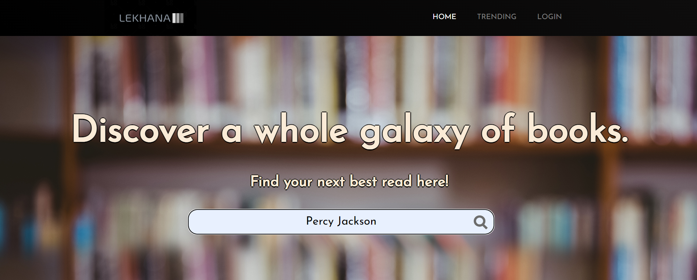

# Lekhana
A web application that uses Google Books API to form a huge collection of books and recommends similar to the user

#------------------------------------------ DebugIT 2023 ---------------------------------------------#

Introduction: 

      A book recommnedation platform that tracks the user's viewing history and recommends similar books to the user.
      This website creates a database of users and their preferences of books and accordingly recommends similar books to them.
      It also has a book searching facility.
      

Tech-Stack Used:

      -Python to create the functionality of the site including API requests, Database Management, and Flask Framework.
      
      -Flask(Python) to build up a framework to dynamically create pages for the website. Flask-Login is used for facilitating user management.
      
      -Google Books API & Books API(New York Times) to get data of the books searched and the books to be recommended. Also gets New York Times Bestsellers.
      
      -SQLAlchemy(Python-Flask) to create a database system to store the user's login details and also their book preferences.
      
      -HTML to build the templates which Flask uses for building up sites.
      
      -CSS to give styling to the HTML framework and give the site a visual appeal.
      
      -JavaScript to control the simple events on the HTML webpage.
      
      -Render.com to deploy the web application.
      
Features:

      -Responsive
            The complete website is responsive, i.e, changes visuals as per the screen size of the user.
      
      -Navigation Bar
            The navigation bar provides a quick way to move through different sections of the website.
         
      -Book Searching
            The website uses Google Books API to search for the query entered in the search box provided.
            The search results are listed in descending order of their ratings on the Google Books API.
            
            
          
      -Book Details
            Each book has a dynamically created details page which lists important details of the book.
            It also provides links to Amazon, Flipkart and Google Books for the book.
            
      -Trending Books
            The New York Times Books API gives the Latest Bestsellers of all categories.
            They are shown at the homepage as a slider giving slight details about them.
            The titles redirect to their Amazon buying link.
            
      -Recommendation System
            The recommendation system works by getting hold of the most viewed genre and the top two most viewed authors by the user.
            It then gets the books for all these constraints, merges them together and shows them in descending order of their rating.
            
      -User Login System
            The website uses Flask-Login and SQLAlchemy together to create a simple yet effective login system.
            It allows login for only registered users and users can sign up on the sign up page.
            The password also has constraints so that users don't enter easily guessable password.
            
